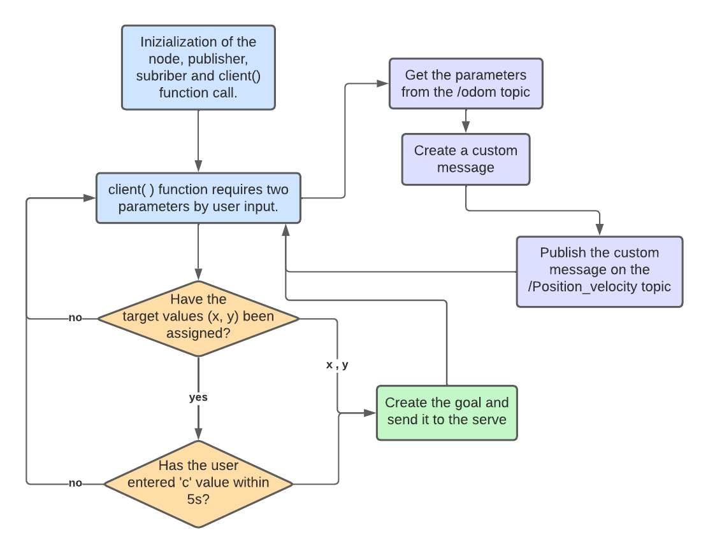

# Research Track: Assignment 2

Mura Alessio S4861320

## Description

This project is about to implement, in **ROS**, a mobile robot which moves in a 3D space and has to reach a desired position by avoiding obstacles. The user is able to control the robot in 3D simulation environment called _Gazebo_. In order to do this, the project requires to implement:

- (a) A node that implements an action client, allowing the user to set a target (x, y) or to cancel it. The node also publishes the robot position and velocity as a custom message (x,y, vel_x, vel_z), by relying on the values published on the topic /odom.
- (b) A service node that, when called, prints the number of goals reached and cancelled;
- (c) A node that subscribes to the robot’s position and velocity (using the custom message) and prints the distance of the robot from the target and the robot’s average speed.

## Nodes

As we can clearly see, inside the scripts folder there are six python file that represent our nodes:

1. `bug_as.py` is the action server node that receives the desired position from the client and calls the needed services in oreder to bring the robot to the desired position (setted as ROS parameter).

2. `user_input.py` is the action client node that deals with asking the user to enter the coordinates (x, y), or to cancel them, that the robot has to reach. After that,it publishes the robot position and velocity as a custom message on the /_Position_velocity_ topic, relying on the values of the /_odom_ topic. The structure of the node is described in the following flowchart:

<figure>

<figcaption align = "center"></figcaption>
</figure>
 

3. `print_info.py` is the node that prints, on the console, the distance of the robot from the desired position and its average speed. These parameters are taken from the _/Position_velocity_ topic as a custom message. The information is printed with the frequency set as a parameter in the launch file.

4. `go_to_point_service.py` is the file which implements a service node. When the node is called, it makes the robot moves to the desired position.

5. `wall_follow_service.py` is the file which implements a service node. When the node is called, it allows the robot to move around an obstacle (such as a wall).

6. `service.py` is the service node. When the node is called, it prints the number of successfull reaching desired position and the number of cancelling goals.

## Install and run

First of all, we need to run the master:

    roscore

In order o install the module, we need to go inside the `src` folder of our ROS workspace and clone the assignment folder:

    git clone https://github.com/Miryru/RT_assignment_2

and from the root directory of our ROS workspace run the command:

    catkin_make

To run the program, we have to install **xterm**:

    sudo apt-get install xterm

Finally, to run the code:

    roslaunch assignment_2_2022 assignment1.launch

## Possible improvements

As far as some improvements are concerned, we can suggest the following ideas:

1. We could add a graphical marker in the arena that represents the position the robot has to reach, in order to have a clear view of robot's goal.

2. If in the desired position there is an obstacle, the robot tends to crash into it. In order to avoid it, it is possible to find a way to recognize if in that position there is an obstacle or not.

3. Create a function that allows us to recognize the size of the arena, in order to bound the coordinates. In fact, when the user enter even a value out of the space of the simulation, the program doesn't work in the best way.

4. When the robot encounters an obstacle, it tends to choose itself which direction to take. It would be better if it could choose the direction to take based on the shortest distance to the desired position.
